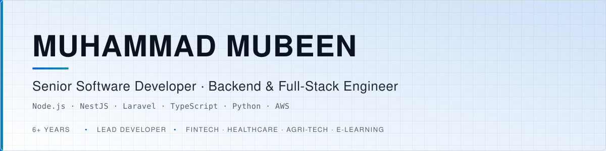
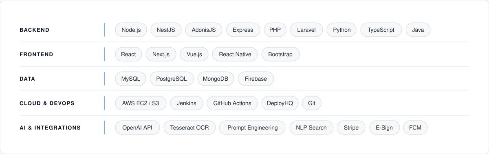

  <picture>
    <source media="(prefers-color-scheme: dark)" srcset="assets/banner-dark.svg">
    <source media="(prefers-color-scheme: light)" srcset="assets/banner-light.svg">
    
  </picture>

  
  &nbsp;
  
  &nbsp;
  
  &nbsp;
  

 

## About

Software engineer with **6+ years** designing and delivering production systems end to end — architecture, database design, API contracts, CI/CD, and release. I've served as **Lead Developer** on multiple complex products, owning technical direction and code quality for the teams around me, across fintech, healthcare, agri-tech, e-learning and marketplace domains.

<table>
<tr>
<td width="33%" valign="top">

**Architecture**

Microservices and monolithic systems chosen on scale and team shape. Multi-tenancy, RBAC, audit trails, REST API contract design.

</td>
<td width="33%" valign="top">

**Engineering**

Query optimization over large datasets, bulk data pipelines, payment gateway and e-sign integrations, CI/CD to AWS.

</td>
<td width="33%" valign="top">

**Leadership**

Code review standards, branching strategy and PR workflow, mentoring junior engineers, cross-functional delivery.

</td>
</tr>
</table>

 

## Technical Stack

<picture>
  <source media="(prefers-color-scheme: dark)" srcset="assets/stack-dark.svg">
  <source media="(prefers-color-scheme: light)" srcset="assets/stack-light.svg">
  
</picture>

 

## Selected Work

> Client work is described at architecture level — production code lives in private company repositories.

| Project | Domain | Role | Core Stack |
|:--|:--|:--|:--|
| **LoanClod** | Fintech | Developer · AI sub-project lead | Laravel · MySQL · Python · OpenAI |
| **Dayzee Farms** | Agri-tech / E-commerce | Lead Developer | Node.js · React Native · AWS · Jenkins |
| **EnrichKids** | E-learning | Backend architect | NestJS · TypeScript · Next.js · Stripe |
| **340B Price Guide** | Healthcare | Developer | Laravel · Python · NLP |
| **Tradefindry** | Marketplace | Developer | AdonisJS · React · Firebase |

 

### LoanClod — Multi-Tenant Fintech Loan Platform

`Laravel` · `JavaScript` · `MySQL`

End-to-end loan lifecycle management for multiple financial institutions on a custom domain-based multi-tenant architecture. Built paperless documentation with e-sign integration, borrower task management, and an RBAC model spanning bank admins, supervisors and borrowers with a full audit trail and document tracking.

> **Sub-project — AI Document Classification Engine** `Python` · `Tesseract OCR` · `OpenAI API`
> Led an OCR + LLM pipeline that maps uploaded documents to the correct loan tasks automatically, with custom prompt engineering. Bulk multi-document upload with automatic classification accelerated borrower onboarding and cut manual loan-officer workload.

### Dayzee Farms — Agri-Tech Livestock & E-Commerce Ecosystem

`Node.js` · `React Native` · `MySQL` · `AWS EC2/S3` · `Jenkins`

**Lead Developer.** Owned full database architecture, API development and DevOps across web, mobile and admin platforms.

- Integrated MCB and Bank Alfalah payment gateways with 2FA across all clients
- Built a technician (artificial insemination) mobile app with order acceptance and real-time delivery tracking
- Established Jenkins CI/CD with automated deployments to AWS EC2; owned PR review and branching strategy

### EnrichKids — Online Learning Platform

`NestJS` · `TypeScript` · `Next.js` · `MySQL` · `Stripe`

Designed and implemented the backend microservices architecture for an e-commerce-style e-learning product — course management, authentication, institution onboarding and Stripe payments — including a self-registration and course-publishing workflow that lets institutions list and sell courses independently.

### 340B Price Guide — Healthcare Drug Pricing Platform

`Laravel` · `Python` · `MySQL` · `NLP`

- Optimized critical SQL queries, significantly improving global search performance across large pharmaceutical datasets
- Re-engineered CSV bulk-import pipelines for drug names, pricing and classifications — improving upload speed and reliability
- Implemented NLP-based conversational search for natural-language drug catalogue queries through a chat interface

### Tradefindry — Interior Decorators & Vendors Marketplace

`Node.js` · `AdonisJS` · `React` · `MySQL` · `Firebase`

Two-sided marketplace with RESTful APIs and Firebase push notifications, RBAC across admin, designer and vendor roles, designer editor boards, vendor catalogue, geolocation search and an event scheduler.

<b>Additional projects</b>

 

**Tamam — Public Survey Application** `Laravel` · `Vue.js` · `MySQL` · `Firebase`
Full-stack survey platform with a dynamic form builder, scheduling, and SMS/Firebase notification delivery, with separate mobile and admin panels.

**O2W — Crypto Mining Remote Control Portal** `Node.js` · `Express` · `React`
Real-time remote monitoring and control of mining machines with individual and group start/stop commands, plus secure peer-to-peer wallet transfers.

**Pakistan Drug Manual — Desktop Application** `Java` · `Java Swing` · `MySQL`
Windows desktop application for searching pharmaceutical products by manufacturer, distributor and pricing, built on OOP principles for non-technical end users.

 

## Experience

| Role | Company | Period |
|:--|:--|:--|
| **Software Developer (Tier 3)** | Genetech Solutions | 2021 – Present |
| **Software Engineer** | DTS (Digital Transformation Systems) | Jan 2020 – Nov 2021 |

## Education

| Degree | Institution | Year |
|:--|:--|:--|
| **MS — Computer Science & IT** | NED University of Engineering & Technology | 2023 |
| **BS — Computer Science** | University of Sindh | 2019 |

 

## GitHub

  
  &nbsp;&nbsp;
  

---

  Open to Senior / Lead Software Developer roles ·
  <a href="mailto:mmubeen.khatri@gmail.com">mmubeen.khatri@gmail.com</a> ·
  <a href="https://linkedin.com/in/muhammadmubeen-khatri-209105101">LinkedIn</a>

